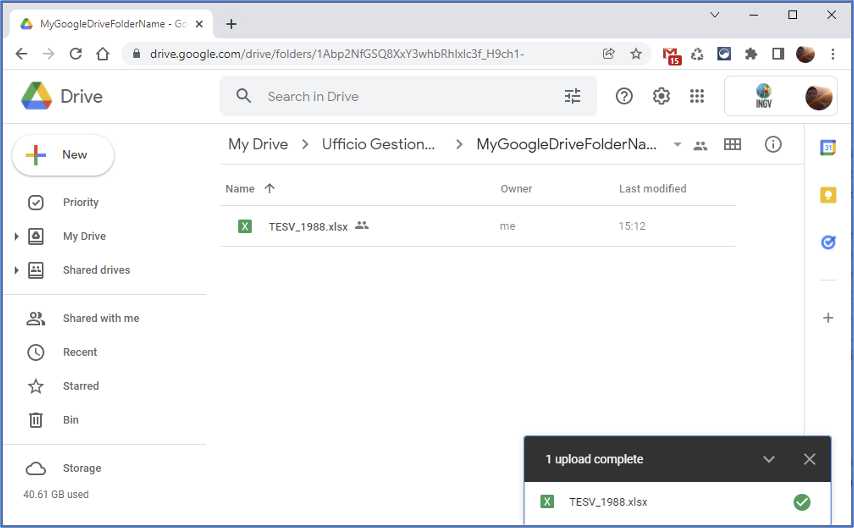
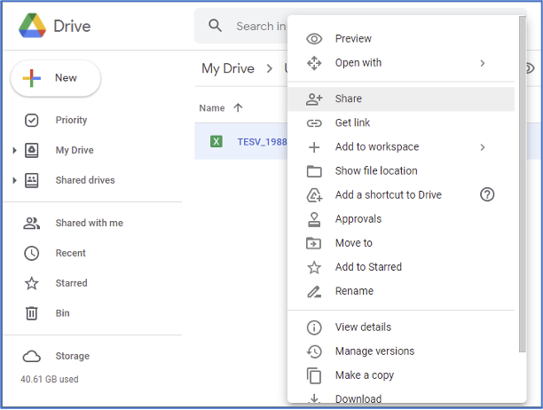
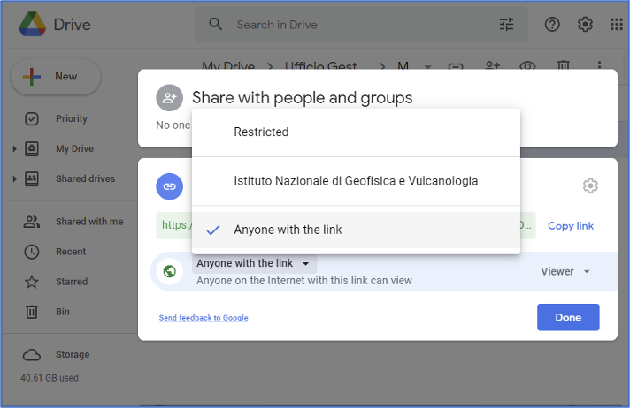

Caricamento del *dataset* sullo spazio **Google Drive** personale
-----------------------------------------------------------------

Inizialmente l’utente carica il *dataset* all’interno di uno spazio dati personale e privato sul cloud di **Google Drive**.

I passi necessari sono illustrati nelle seguenti figure.

Tramite il proprio spazio personale istituzionale sul Google Drive, l’utente carica il dataset da pubblicare sul
portale DataRep.

Successivamente l’utente rende accessibili gli stessi files del dataset mediante la funzionalità *“Condividi"(share)*.

E' necessario selezionare l’opzione *“Chiunque abbia il link” (Anyone with the link)* generando univocamente un link per ciascun file che sarà utilizzato dal Metadata Manager per l’operazione di upload su DataRep.

Un dataset può essere composto da uno o più file a cui corrisponderanno di conseguenza più *link*.

E' consigliato archiviare in un unico file di tipo **zip** o **tar**, **rar** i differenti *file* , così da creare un unico link di condivisione).