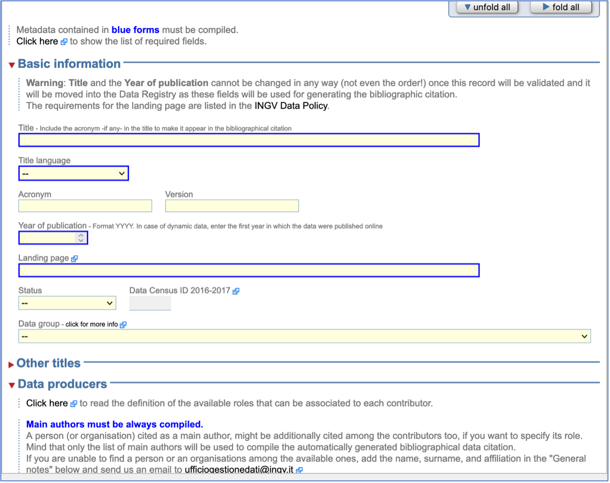
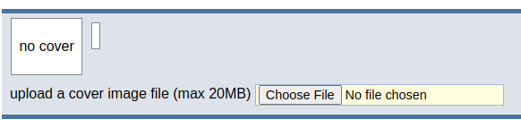
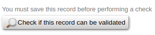
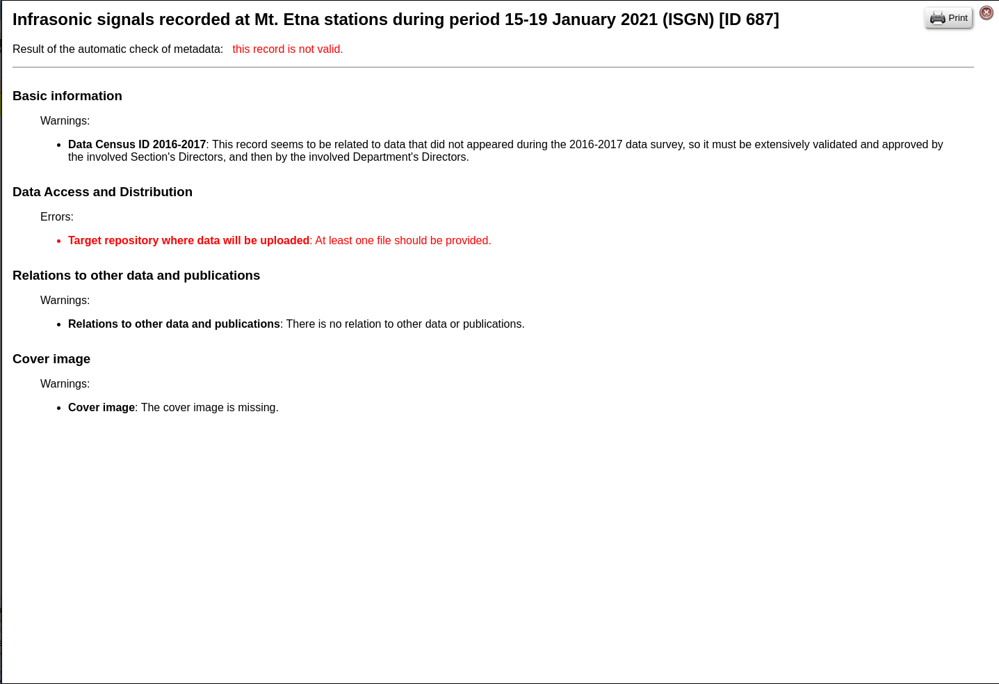

Compilazione dei *Metadati*
---------------------------

Scelta la modalità di creazione del nuovo record (paragrafo precedente), il
sistema mostrerà un *web-form* con diversi campi da compilare che costituiscono
i *metadati* caratteristici di una pubblicazione scientifica.

Solo dopo aver cliccato il bottone "Create" in fondo alla pagina la scheda sarà
creata nel sistema e sarà editabile in ogni sua parte.

Quando la scheda viene creata sarà inserita nel metadata editor sotto forma di
bozza (*draft*) e sarà considerata tale fino alla fine del processo di
validazione, processo che verrà avviato dall'utente quando avrà terminato la
compilazione della scheda.

L'utente descriverà il dataset compilando esaustivamente quanti più campi
possibili tra quelli disponibili come nella scheda di esempio della seguente
figura.

.. note::

 In particolare, il campo ``“Landing page”`` non deve essere compilato, perché
 questa informazione verrà restituita automaticamente dalla logica del portale
 DataRep non appena, verrà fatta richiesta di pubblicazione.

Nella compilazione della scheda, dovranno essere indicati anche un *referente*
**scientifico** e uno **tecnologico** (le due figure possono coincidere). I
referenti andranno indicati nella sezione dei metadati denominata ``“Info
specific to INGV”``. Oltre ai metadati obbligatori, evidenziati in blu nella
scheda (Fig. sopra), si suggerisce di compilare anche informazioni utili come la
copertura temporale, geografica e soprattutto eventuali relazioni con altri dati
o pubblicazioni nell'apposita sezione ``“Relations to other data and
publications”``.

Infine, è anche possibile caricare un'immagine di copertina in fondo al
*web-form* alla scritta ``“upload a cover image file”``.

Durante la compilazione dei campi è possibile verificarne la correttezza in ogni
momento agendo sul bottone ``“Check if this record can be validated”``,
posizionato in alto sulla form di caricamento dei metadati.

Se il processo rileva errori o campi obbligatori non compilati, tutte le anomalie
saranno dettagliatamente elencate dal *Metadata Editor* e l'utente potrà procedere
alla loro risoluzione.

Si consiglia di salvare frequentemente le modifiche durante la compilazione
cliccando sul bottone ``"Save"`` in fondo alla scheda per evitare il rischio di
perdere informazioni già inserite. La scheda può essere compilata a più riprese
sia da parte dal referente scientifico che dal referente tecnologico, ma non
nello stesso istante.

Se è necessario permettere ad altre persone di editare la scheda, queste possono
essere aggiunte dai referenti nella sezione ``Additional users allowed to update
metadata of this record`` nella sezione di metadati ``“Info specific to INGV”``.

Quando la compilazione della bozza della scheda sarà ultimata e il sistema di
verifica automatico non rileverà più errori, l'utente potrà avviare il processo
di validazione cliccando sul bottone ``“Start the validation process”``
all'inizio della scheda.
