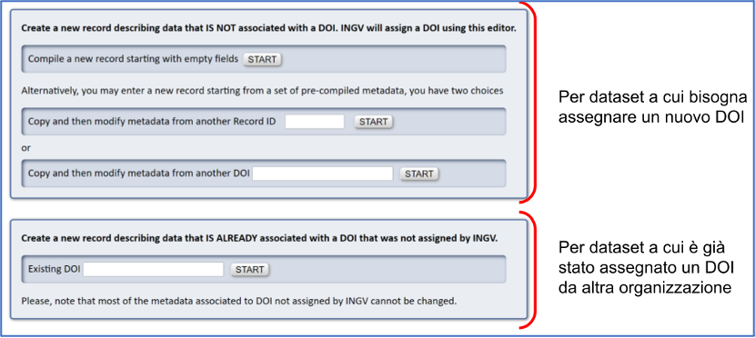

Crezione della *scheda descrittiva* dal Metadata Editor
-------------------------------------------------------

Ottenuto il link di condivisione, l’utente si autentica sul portale del Metadata
Editor utilizzando il proprio account istituzionale (*nome.cognome@ingv.it* come
per l'accesso alla posta elettronica) al fine di **creare** una scheda
descrittiva del *dataset*:

#. Il primo passo consiste nella *creazione* di una nuova scheda descrittiva in
   **bozza - Drafts**, scegliendo se iniziare da una *scheda vuota* o dalla
	 *copia*  di una scheda già esistente da completare;
#. A questo punto il sistema consente di inizializzare una nuova bozza,
   permettendo all'utente di scegliere se creare un nuovo *record* che descrive
	 il *dataset*, a cui: a) non è ancora stato assegnato nessun DOI, b) è già
	 stato assegnato un DOI.

