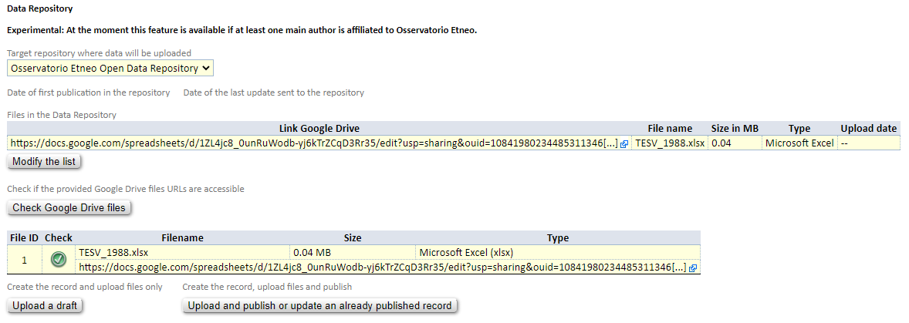

Pubblicazione sul portale **DataRep**
-------------------------------------

L'ultimo step, nel processo di upload di un dataset sul portale DataRep consiste
nel creare il record sul repository. L'interfaccia del *Metadata Editor* mette a
disposizione, nella sezione ``"9. Data Access and Distribution"``, la 
possibilità di selezionare il repository DataRep. Una volta selezionato il 
repository, l'interfaccia permette di caricare i file che appartegono alla
pubblicazione, come mostrato nella figura sottostante.

La *landing-page* creata dal Portale DataRep è mostrata nella figura sotto

.. image:: assets/pictures/18.png
   :align: center
   :width: 800

In particolare è possibile notare come la pagina creata conterrà:

- un estratto dei metadati inseriti sul Metadata Editor,
- il DOI assegnato alla pubblicazione,
- il dataset,
- la possibilità di esportare i metadati nei diversi formati supportati dal portale.

Una email notifica gli amministratori del portale che una nuova pubblicazione è 
stata effettuata ed è disponibile; sarà loro compito accettarla per renderla 
visibile tra i contenuti recenti visualizzati nella *home-page* di DataRep.

.. image:: assets/pictures/19.png
   :align: center
   :width: 800