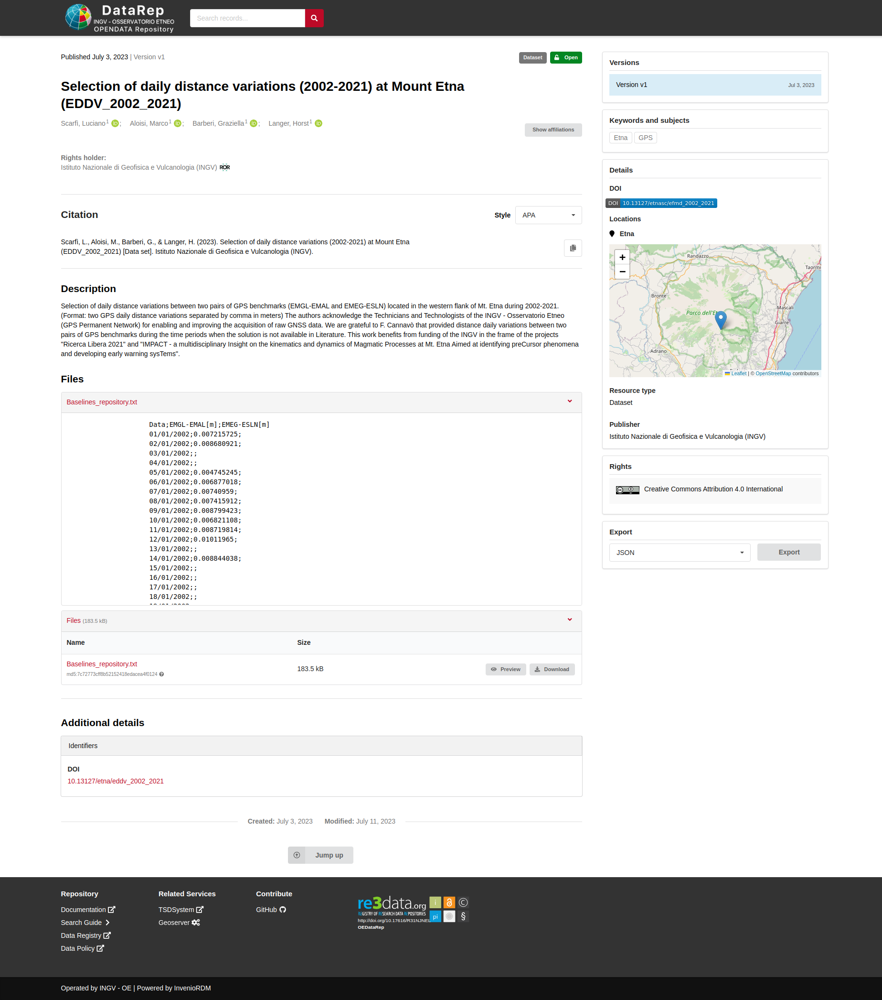
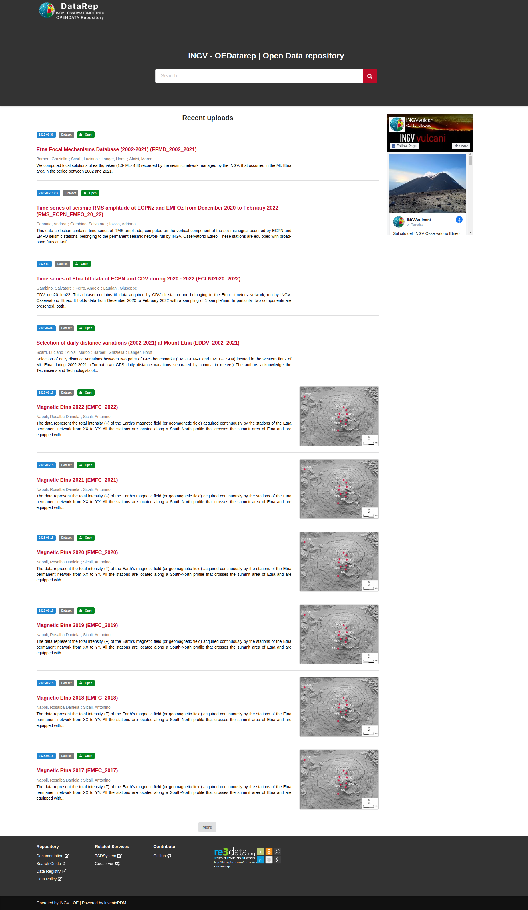

Pubblicazione sul portale **DataRep**
-------------------------------------------------------------

L'ultimo step, nel processo di upload di un dataset sul portale DataRep,
è demandato ai responsabili dell'Ufficio Gestione Dati. L'interfaccia web del
*Metadata Editor*, per queste figure, mette a disposizione due bottoni, mostrati
nella figura sottostante.

- Il bottone ``"Upload a draft"`` caricherà su DataRep una bozza della scheda,
  contenente dati e metadti senza rendere la *landing-page* pubblicamente
  accessibile.
- Il bottone ``"Upload and publish or edit an already published record"``,
  caricherà su DataRep la scheda contenente dati e metadti e pubblicherà
  automaticamente la *landing-page*.

  .. image:: assets/pictures/17.png
  	 :align: center
     :width: 600

La *landing-page* creata dal Portale DataRe è mostrata nella figura sotto

In particolare è possibile notare come la pagina creata contenga:

- un estratto dei metadati inseriti sul Metadata Editor,
- il DOI specifico del dataset,
- il dataset stesso,
- la possibilità di esportare i metadti nei diversi formati supportati dal portale.

Una email notifica gli amministratori che una nuova pubblicazione è disponibile,
sarà loro compito accettarla per renderla visibile tra i contenuti recenti
visualizzati nella home page di DataRep.

