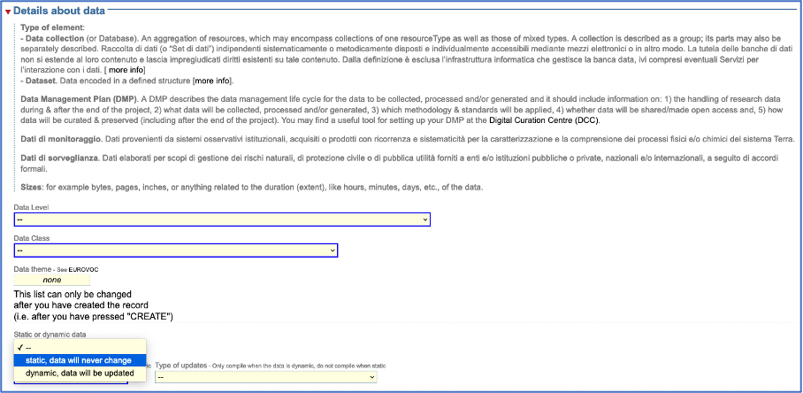
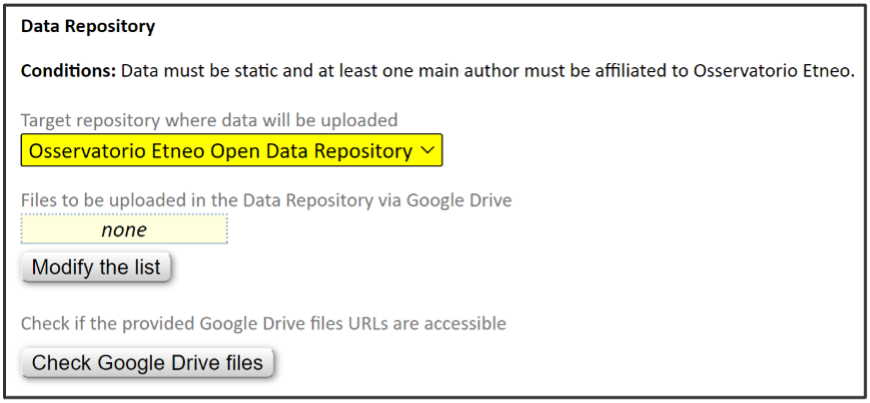
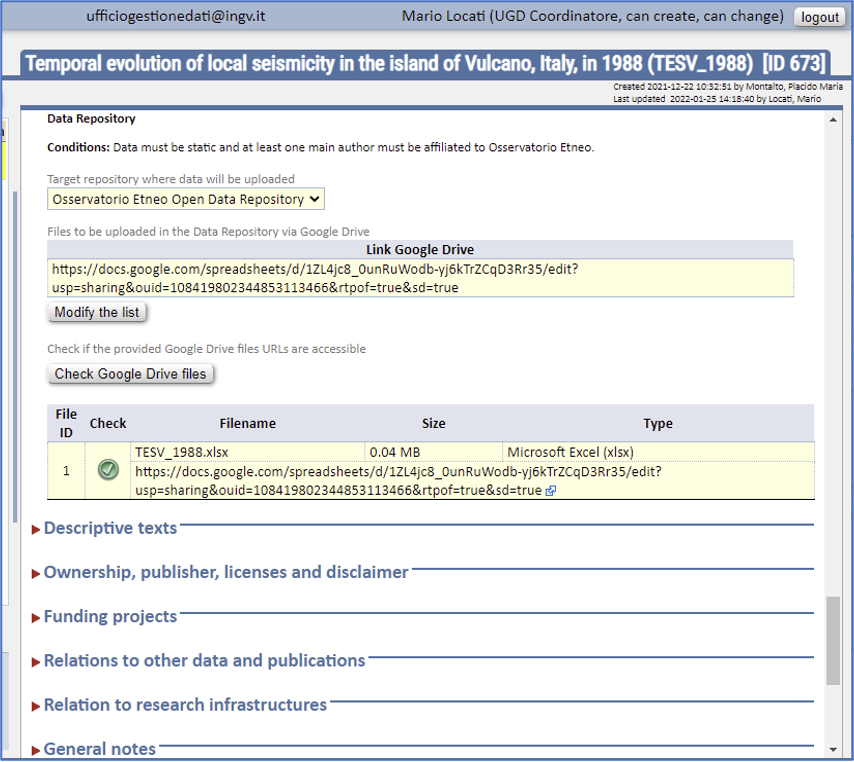

Selezione dell'elenco di file da pubblicare
===========================================

A questo punto l’utente aggiunge l’elenco dei file da caricare su DataRep:

Il Metadata Editor mostrerà le funzioni di caricamento su DataRep quando queste due condizioni sono soddisfatte:

1. Il *dataset* **deve** essere dichiarato **statico** nella sezione di metadati ``“Details about data”`` .

	Con statico si intende che il dataset non verrà mai più aggiornato dopo la sua pubblicazione. Se necessario, in futuro sarà possibile pubblicare nuove revisioni, pubblicando un nuovo dataset seguendo la stessa procedura con l’accortezza di indicare la relazione con la versione precedente nella sezione di metadati **“Relations to other data and publications”**.
   Nella scheda in basso un esempio di selezione del tipo in statico. 

2. Almeno una persona elencata tra i **“Main authors”** della sezione di metadati ``“Data producers”`` deve essere **affiliata all’Osservatorio Etneo**. Le funzioni per caricare dati su DataRep saranno mostrate solo dopo che l’elenco degli autori sarà compilato.
	
	E’ possibile verificare in ogni momento le affiliazioni di ciascun autore cliccando sul bottone “Check affiliations” sotto l’elenco degli autori. Ciascun autore affiliato all’INGV può aggiornare direttamente le proprie informazioni (affiliazione compresa) modificando il proprio profilo nella sezione “People” del Metadata Editor. Le modifiche apportate ai profili personali saranno monitorate.

.. image:: assets/pictures/8.png

A questo punto è possibile procedere alla selezione dei *file* da pubblicare su **DataRep** che erano precedentemente stati caricati sul **Google Drive**.

Si elencano i file da caricare su DataRep nella sezione di metadati ``“Data Access and Distribution”.`` I file vanno indicati sotto forma di link a Google Drivee vanno aggiunti cliccando il bottone ``“Modify the list”``. Per verificare che i dati siano caricabili su DataRep cliccare sul bottone ``“Check Google Drive files”`` .

.. image:: assets/pictures/9.png

