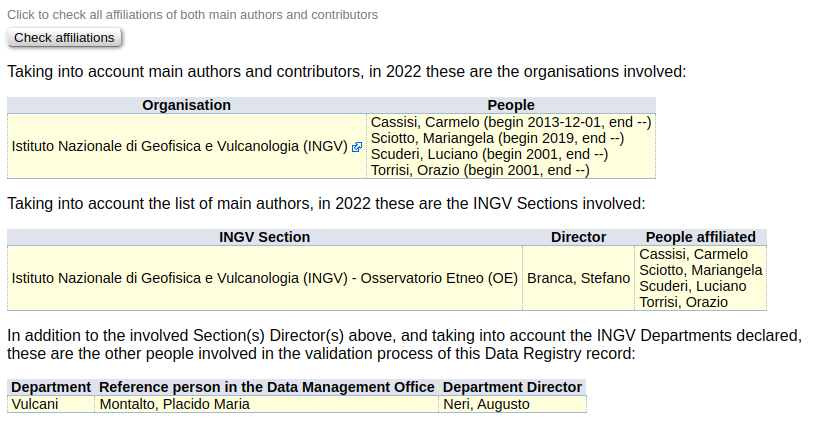
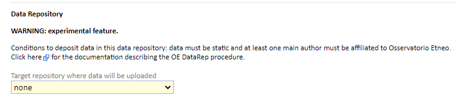
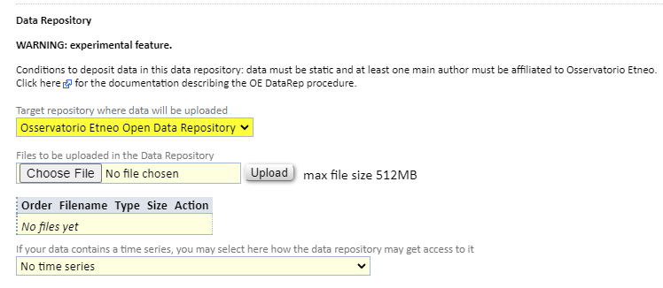
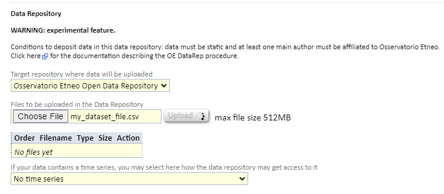
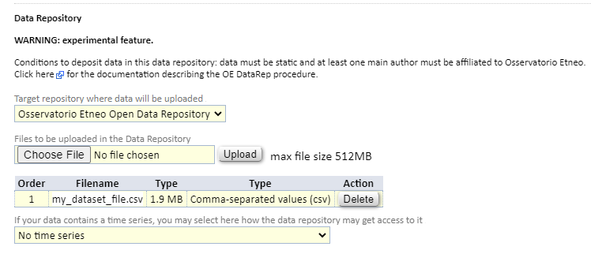

Selezione dell'elenco di file da pubblicare
-------------------------------------------

A questo punto l'utente aggiunge l'elenco dei file da caricare su DataRep:

Il Metadata Editor mostrerà le funzioni di caricamento sul portale DataRep
quando le due condizioni seguenti saranno soddisfatte:

1. Il *dataset* **deve** essere dichiarato **statico** nella sezione di metadati
   ``“Details about data”``. Se necessario, in futuro sarà possibile pubblicare nuove revisioni, pubblicando un nuovo dataset seguendo la stessa procedura con l'accortezza di indicare la relazione con la versione precedente nella sezione di metadati **“Relations to other data and publications”**. Nell'immagine in basso un esempio di selezione del tipo in statico.

.. image:: assets/pictures/7.png
	 :align: center

.. note::

	Con statico si intende che il dataset non verrà più aggiornato dopo la sua
	pubblicazione.

2. Almeno una persona elencata tra i **“Main authors”** della sezione di metadati
   ``“Data producers”`` deve essere **affiliata all'Osservatorio Etneo**.

.. image:: assets/pictures/8.png
	 :align: center

.. note::

	Le funzioni per caricare dati su DataRep saranno mostrate solo dopo che l'elenco 
	degli autori sarà compilato.

E' possibile verificare in ogni momento le affiliazioni di ciascun autore
cliccando sul bottone *Check affiliations* sotto l'elenco degli autori.

Ciascun autore affiliato all'INGV può aggiornare direttamente le proprie
informazioni (affiliazione compresa) modificando il proprio profilo nella
sezione “People” del Metadata Editor. Le modifiche apportate ai profili
personali saranno monitorate.

A questo punto è possibile procedere alla selezione dei *file* da pubblicare su
**DataRep**. Per fare ciò:

1. espandere la sezione ``“Data Access and Distribution”`` di metadati;

2. selezionare *Osservatorio Etneo Open Data Repository* nel campo ``“Target
   Repository where data will be uploaded”``;

3. effettuare il *caricamento* dei file che compongono il *dataset* direttamente sul *repository*
   OEDataRep attraverso il *form* di *upload*;

4. infine cliccare sul bottone *SAVE* in fondo alla scheda per salvare la Bozza
   creata.