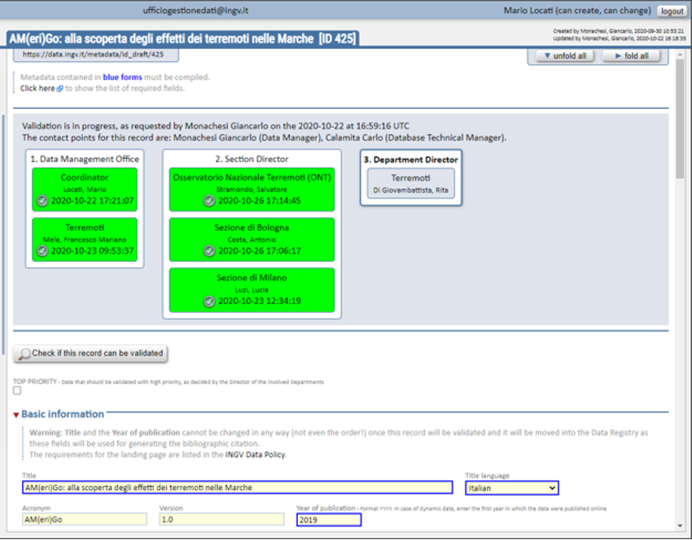

Validazione della scheda e assegnazione del DOI (Ufficio Gestione Dati)
-----------------------------------------------------------------------

Quando la compilazione della scheda sarà completata si potrà procedere alla 
**validazione** cliccando sul bottone ``“Start the validation process”``. 

.. warning::
   in caso di problemi, l’Ufficio Gestione Dati si occuperà di contattare 
   l’utente per eventuali correzioni o integrazioni.

La figura seguente mostra gli stati di avanzamento del processo di validazione. 

La validazione potrebbe arrivare fino a tre gradi di approvazione a seconda delle 
caratteristiche del dataset e degli autori indicati:

- il primo grado di validazione è in capo all’*Ufficio Gestione Dati*, nello 
  specifico il coordinatore e un referente per ciascuno dei Dipartimenti indicati;
- il secondo grado è in capo ai *Direttori delle Sezioni* coinvolte identificate
  automaticamente dal Metadata Editor in base alle affiliazioni disponibili nella
  sezione ``“People”`` corrispondenti agli autori elencati;
- il terzo grado di validazione è in capo ai *Direttori dei Dipartimenti* indicati
  in ``“INGV Department”`` nella sezione di metadati ``“Info specific to INGV”.``

.. note::
   se il dataset è una nuova versione di un dataset già validato e pubblicato in
   precedenza, si attiverà automaticamente solo il primo grado di validazione.